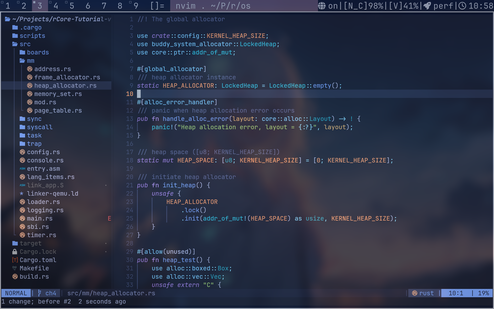

<p align="center">
  
</p>

<h3 align="center">shyweeds · dotfiles</h3>

<p align="center">
  <sub>Arch Linux · dwm · Fish · Neovim · Kitty</sub>
</p>

<p align="center">
  <a href="#-截图">截图</a> ·
  <a href="#-目录结构">结构</a> ·
  <a href="#-快速开始">快速开始</a> ·
  <a href="#-依赖">依赖</a> ·
  <a href="#-特性">特性</a> ·
  <a href="#-手动调整">调整</a>
</p>

<p align="center">
  <a href="README.md">🇺🇸 English</a>
</p>

<br>

> 一套为 **Arch Linux + dwm** 定制的 dotfiles，聚焦 C/C++ 开发体验。
> 窗口管理器简洁高效，编辑器开箱即用，终端美观流畅。

---

## 📸 截图

<p align="center">
  
  <br>
  
</p>

---

## 📁 目录结构

```
dotfiles-dwm/
├── nvim/                         Neovim 编辑器（Lazy.nvim，15 个插件）
│   ├── init.lua
│   ├── lazy-lock.json            锁定插件版本
│   └── lua/
│       ├── config/               选项、键位、自动命令、lazy 引导
│       └── plugins/              每个插件独立配置文件
├── kitty/                        GPU 加速终端模拟器
├── picom/                        合成器（GLX、模糊、阴影、淡入淡出）
├── dunst/                        通知守护进程
├── lazygit/                      终端 Git 客户端
├── yazi/                         终端文件管理器
├── shell_config/
│   ├── bash/.bashrc              Bash 配置（vi 模式、Rust 镜像、别名）
│   └── fish/                     Fish 配置 + 变量（vi 键位、tty1 自动 startx）
├── X_configs/
│   ├── .xinitrc                  X11 会话（启动 dwm、picom、dunst、fcitx5、feh）
│   └── .Xresources               X 资源（DPI 192，JetBrains Mono 17px）
├── scripts/
│   ├── dwm_status.sh             DWM 状态栏（网络 / 电池 / 音量 / 电源 / 时间）
│   ├── battery_checker.sh        低电量通知 + 自动休眠
│   └── wifi_fucking_rescan.sh
├── systemd/user/                 Systemd 用户单元
│   ├── battery.timer             定时电池检查（每 60 秒）
│   └── battery.service           Oneshot 电池监控服务
├── code_config/                  VSCode / VSCodium 配置
│   ├── settings.json             保存时格式化、neovim 扩展
│   └── keybindings.json          自定义建议快捷键
├── gdb/                          GDB 调试配置（项目专用）
├── vim_config_bak/               旧版 Vim 配置（已被 Neovim 取代）
├── my_code_template/cmake/       C++17 CMake 项目模板（clang-tidy、clangd、clang-format）
└── nix-config/                   Nix flake（可复现开发工具：shellharden、ruff、nixd …）
```

---

## 🚀 快速开始

```bash
# 1. 克隆仓库
git clone https://github.com/shyweeds/dots-dwm.git ~/dotfiles-dwm
```

### 手动部署

通过软链接将仓库中的配置文件映射到用户目录：

```bash
# 配置目录 → ~/.config/
ln -sfn ~/dotfiles-dwm/nvim        ~/.config/nvim
ln -sfn ~/dotfiles-dwm/kitty       ~/.config/kitty
ln -sfn ~/dotfiles-dwm/picom       ~/.config/picom
ln -sfn ~/dotfiles-dwm/dunst       ~/.config/dunst
ln -sfn ~/dotfiles-dwm/lazygit     ~/.config/lazygit
ln -sfn ~/dotfiles-dwm/yazi        ~/.config/yazi

# Shell 配置
ln -sf ~/dotfiles-dwm/shell_config/bash/.bashrc  ~/.bashrc
ln -sfn ~/dotfiles-dwm/shell_config/fish         ~/.config/fish

# X11 配置
ln -sf ~/dotfiles-dwm/X_configs/.xinitrc     ~/.xinitrc
ln -sf ~/dotfiles-dwm/X_configs/.Xresources  ~/.Xresources

# 脚本
mkdir -p ~/.local/bin
ln -sf ~/dotfiles-dwm/scripts/dwm_status.sh        ~/.local/bin/dwm_status.sh
ln -sf ~/dotfiles-dwm/scripts/battery_checker.sh   ~/.local/bin/battery_checker.sh
ln -sf ~/dotfiles-dwm/scripts/wifi_fucking_rescan.sh ~/.local/bin/wifi_fucking_rescan.sh

# Systemd 用户单元（电池监控）
mkdir -p ~/.config/systemd/user
ln -sf ~/dotfiles-dwm/systemd/user/battery.timer   ~/.config/systemd/user/battery.timer
ln -sf ~/dotfiles-dwm/systemd/user/battery.service ~/.config/systemd/user/battery.service
systemctl --user daemon-reload
systemctl --user enable --now battery.timer

# 可选
# ln -sf ~/dotfiles-dwm/gdb/gdbinit_bak ~/.gdbinit
# ln -sf ~/dotfiles-dwm/vim_config_bak/.vimrc ~/.vimrc
```

> **安全** — `ln -sf` 可覆盖已有软链接；如有真实文件请先备份。
> <br>**幂等** — 可反复执行；软链接会被直接覆盖。

---

## 📦 依赖

### 核心软件

| 软件 | 用途 |
|---|---|
| [dwm](https://dwm.suckless.org) | 动态窗口管理器 |
| [picom](https://github.com/yshui/picom) | 合成器（阴影、模糊、透明） |
| [dunst](https://dunst-project.org) | 通知守护进程 |
| [kitty](https://sw.kovidgoyal.net/kitty/) | GPU 加速终端 |
| [fish](https://fishshell.com) / bash | Shell |
| [neovim](https://neovim.io) `>= 0.10` | 编辑器 |
| [fcitx5](https://fcitx-im.org) | 输入法框架 |
| [feh](https://feh.finalrewind.org) | 壁纸设置 |
| [lazygit](https://github.com/jesseduffield/lazygit) | 终端 Git 客户端 |
| [yazi](https://yazi-rs.github.io) | 终端文件管理器 |

### Neovim 插件

`<leader>` = `Space`

| 插件 | 功能 |
|---|---|
| [blink.cmp](https://github.com/Saghen/blink.cmp) | 自动补全引擎 |
| [nvim-lspconfig](https://github.com/neovim/nvim-lspconfig) | LSP 服务配置 |
| [conform.nvim](https://github.com/stevearc/conform.nvim) | 自动格式化 |
| [nvim-lint](https://github.com/mfussenegger/nvim-lint) | 异步代码检查 |
| [nvim-treesitter](https://github.com/nvim-treesitter/nvim-treesitter) | 语法高亮 |
| [telescope.nvim](https://github.com/nvim-telescope/telescope.nvim) | 模糊查找器 |
| [neo-tree.nvim](https://github.com/nvim-neo-tree/neo-tree.nvim) | 文件树 |
| [lualine.nvim](https://github.com/nvim-lualine/lualine.nvim) | 状态栏 |
| [gitsigns.nvim](https://github.com/lewis6991/gitsigns.nvim) | Git 行内标记 |
| [which-key.nvim](https://github.com/folke/which-key.nvim) | 键位提示 |
| [flash.nvim](https://github.com/folke/flash.nvim) | 快速跳转 |
| [tokyonight.nvim](https://github.com/folke/tokyonight.nvim) | 配色主题 |
| [nvim-autopairs](https://github.com/windwp/nvim-autopairs) | 自动配对括号 |
| [indent-blankline.nvim](https://github.com/lukas-reineke/indent-blankline.nvim) | 缩进引导线 |
| [todo-comments.nvim](https://github.com/folke/todo-comments.nvim) | 高亮 TODO/FIXME |

### 字体

- [JetBrainsMono Nerd Font](https://github.com/ryanoasis/nerd-fonts)

### Arch Linux 一键安装

```bash
sudo pacman -S --needed \
  dwm picom dunst kitty fish neovim \
  fcitx5 fcitx5-chinese-addons feh \
  lazygit yazi xorg-xrandr xorg-xrdb

yay -S nerd-fonts-jetbrains-mono
```

---

## ✨ 特性

### DWM 桌面环境

- **Picom 合成器** — 双 Kawase 模糊、窗口阴影、透明度渐变、GLX 后端
- **状态栏** — 实时显示网络状态、电池电量、音量、电源模式、时间
- **电池监控** — systemd 定时器每 60 秒检查一次，≤20% 通知，≤10% 自动休眠
- **自动启动** — `.xinitrc` 一键拉起 fcitx5、picom、dunst、壁纸、状态栏
- **Rust 镜像** — Shell 中已配置清华大学 TUNA 镜像源

### Neovim 编辑器

- `<Space>` Leader 键，`which-key` 实时提示
- LSP 开箱支持：`clangd`、`pyright`、`rust-analyzer`、`lua_ls`、`nixd`
- 保存时自动格式化，异步代码检查
- Telescope 模糊查找，Flash 快速跳转
- Tokyonight 配色主题

### 终端体验

- **Kitty** — JetBrainsMono 16px，光标拖尾效果，pywal16 配色，远程控制
- **Fish** — vi 键位绑定，tty1 自动启动 X11
- **Yazi** — 显示隐藏文件，<kbd>y</kbd> 命令自动跳转目录
- **LazyGit** — 禁用自动 fetch

### 其他

- **Nix flake** — 可复现开发环境（shellharden、ruff、nixfmt、nixd、stylua …）
- **VSCode** — 保存时格式化、neovim 扩展、自定义建议快捷键
- **C++ 模板** — CMake 4.2 + clangd + clang-tidy + clang-format 项目模板

---

## ⚙️ 手动调整

部署后根据实际环境调整以下内容：

| 文件 | 需要调整 |
|---|---|
| `~/.xinitrc` | 屏幕分辨率 (`xrandr --output eDP --mode`)、壁纸路径、输入法 |
| `~/.Xresources` | DPI 值（当前 `192` 适用于 2K 高分屏） |
| `~/.config/fish/config.fish` | 机器相关路径（Cargo、Comate 等） |
| `~/.local/bin/dwm_status.sh` | 电池路径 (`/sys/class/power_supply/BAT0`) |

<br>
<p align="center">
  <sub>Made with grit by shyweeds</sub>
</p>
